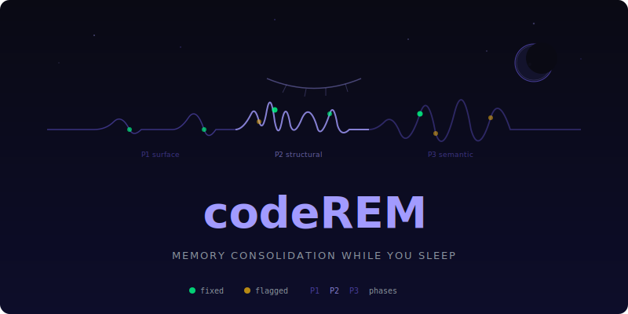

<p align="center">
  
</p>

**Your AI agent's memory decays every day. Dead links, stale facts, broken references. codeREM consolidates it while you sleep.**

codeREM is a memory consolidation system for Claude Code. It runs three phases of analysis on your agent's memory files -- surface cleanup, structural integrity, semantic verification -- then writes what it learned into autobiographical episodes. Like REM sleep for your codebase.


## Why This Exists

Claude Code stores persistent memory in markdown files. Over time, these files accumulate problems:

- File paths that no longer exist
- Relative dates that become meaningless ("last Thursday")
- Duplicate information across files
- Stale facts that contradict current state
- Broken cross-references between memory files

You don't notice until your agent gives you confidently wrong answers based on memory from three weeks ago. codeREM catches these before they compound.

## How It Works

During REM sleep, your brain replays the day's experiences, strengthens useful connections, and prunes what doesn't matter. codeREM does the same thing in three phases:

```
Phase 1: Surface Cleanup          Phase 2: Structural Integrity       Phase 3: Semantic Verification
- Dead path detection              - Cross-reference validation         - Fact vs. current state
- Relative date conversion         - Pointer file verification          - Contradiction detection
- Frontmatter normalization        - Index consistency (MEMORY.md)      - Staleness scoring
- Duplicate detection              - Canonical source alignment         - Recommended deletions
```

Each phase calls Claude with a structured prompt, gets back JSON actions (fix/flag/delete), applies fixes automatically, and git-commits the changes. The dream journal logs everything.

## Quick Start

```bash
# Clone and install
git clone https://github.com/drewbeyersdorf/codeREM.git
cd codeREM
bash install.sh

# See what it would fix (changes nothing)
deep-dream --dry-run

# Run all three phases
deep-dream

# Run nightly at 3 AM
cp systemd/*.service systemd/*.timer ~/.config/systemd/user/
systemctl --user enable --now nightly-dream.timer
```

The installer symlinks all 5 tools to `~/.local/bin/`, creates a config at `~/.config/coderem/coderem.conf`, and checks your dependencies. Edit the config to point at your memory directory.

## CLI

### `deep-dream` -- the consolidation engine

```
$ deep-dream

  deep-dream -- memory consolidation agent
  =========================================

=== Phase 1: Surface Cleanup ===

[03:00:12] Starting phase 1...
[03:00:12] Assembling context...
[03:00:14] Prompt assembled (195KB). Calling Claude (sonnet)...
[03:08:41] Claude returned 12 actions.
  FIXED api-migration.md: convert "last Thursday" to "2026-03-20"
  FIXED infrastructure.md: remove dead path ~/projects/old-auth-service/
  FIXED vendors.md: update contract value from "$20K" to "$12K" (renegotiated)
  FLAG [warning] competitors.md: market analysis last updated 2026-03-01 (24 days stale)
  ...

[03:08:42] Phase 1 summary: 12 findings across 47 files. 10 fixes, 2 flags.
[03:08:42] Git commit: phase 1 changes committed.

=== Phase 2: Structural Integrity ===

[03:08:43] Starting phase 2...
  FIXED MEMORY.md: add missing pointer for metrics.md
  FLAG [error] architecture.md: canonical source ~/docs/architecture.md has diverged
  ...

=== Phase 3: Semantic Verification ===

[03:18:01] Starting phase 3...
  FLAG [warning] metrics.md: claims "conversion at 3.2%" but dashboard shows 2.8%
  FLAG [info] strategy.md: growth plan section references Q1 but Q1 ended 3 weeks ago
  ...

  =========================================
  Deep Dream Complete
  =========================================
  Fixes applied: 14
  Items flagged: 10
  Journal: memory-backups/dream-journal-2026-03-25.md
  =========================================
```

### `chronicle-writer` -- two-model writing pipeline

Takes dream findings and turns them into autobiographical episodes. Llama (72B on local GPU) generates structured outlines. Claude writes the prose.

```bash
# Write from today's findings
chronicle-writer

# Write for a specific section
chronicle-writer --section ii-the-machine

# Just get the Llama outline, skip Claude
chronicle-writer --llama-only
```

### `render-image` -- GPU illustration generator

SDXL Turbo on a local GPU. 0.3 seconds per image. Five art styles.

```bash
render-image "a frog leaping into a data pipeline" output.png --style silverstein
render-image "memory consolidation as a neural network" cover.png --style sketch
render-image "entropy in a kitchen" entropy.png --style banksy
```

| Style | Aesthetic |
|-------|-----------|
| `silverstein` | Shel Silverstein pen-and-ink line art |
| `banksy` | High-contrast stencil street art |
| `sketch` | Pencil on aged paper, architectural drawing |
| `terminal` | Green-on-black hacker aesthetic |
| `diagram` | Clean technical schematic |

### `chronicle-render` -- scene extraction and illustration

Reads a chronicle episode, extracts 3-5 visual moments, generates illustrations in any style.

```bash
chronicle-render episode.md --style silverstein
chronicle-render episode.md --illustrations-only
chronicle-render --list-styles
```

### `nightly-dream` -- scheduled automation

Systemd timer that runs at 3 AM every night. All three dream phases, then generates one chronicle episode, rotating through sections by day of year. See [`systemd/README.md`](systemd/README.md) for setup.

```bash
# Check timer status
systemctl --user status nightly-dream.timer

# Run manually
nightly-dream

# View last night's log
cat ~/.config/coderem/logs/nightly-dream-$(date +%Y-%m-%d).log
```

## Architecture

```
                        +------------------+
                        |   nightly-dream  |
                        |   (3 AM cron)    |
                        +--------+---------+
                                 |
                    +------------+------------+
                    |                         |
              +-----+------+          +------+-------+
              | deep-dream |          | chronicle-   |
              | (3 phases) |          | writer       |
              +-----+------+          +------+-------+
                    |                        |
           Claude CLI                  +-----+------+
           (sonnet/opus)               |            |
                    |              Llama 72B    Claude CLI
                    |              (local GPU)  (sonnet)
              +-----+------+           |
              | memory dir |     +-----+------+
              | (.md files)|     | chronicles |
              | + git repo |     | (.md files)|
              +-----------+      +-----+------+
                                       |
                                 +-----+------+
                                 | render-    |
                                 | image      |
                                 +-----+------+
                                       |
                                  SDXL Turbo
                                  (local GPU)
```

## What It Produces

Every night, codeREM generates:

1. **Dream journal** -- timestamped log of every fix, flag, and skip across all three phases
2. **Git history** -- one commit per phase, so you can diff or rollback any consolidation run
3. **Chronicle episodes** -- autobiographical short stories that emerge from the day's findings
4. **Illustrations** -- AI-generated art in five distinct styles

The dream journal is your audit trail. The git history is your undo button. The chronicles are the creative output -- a book being written one episode per night, entirely from what the memory system learned that day.

## Example Output

See [`examples/dream-journal-2026-03-24.md`](examples/dream-journal-2026-03-24.md) for a full dream journal from a real run -- 19 fixes applied, 13 items flagged across 98 memory files in 36 minutes.

## Configuration

After running `install.sh`, edit `~/.config/coderem/coderem.conf`:

```bash
# Point at your Claude Code memory files
MEMORY_DIR="$HOME/.claude/projects/-home-$(whoami)/memory"

# Choose your model (sonnet is fast, opus is thorough)
MODEL="sonnet"

# GPU host for chronicle-writer and render-image (optional)
GPU_HOST="localhost"
```

See [`coderem.conf.example`](coderem.conf.example) for all options.

## Requirements

**Core (deep-dream only):**
- Claude Code CLI (`claude`) installed and authenticated
- `jq`
- Python 3.12+
- Bash 5+

**Optional (chronicle + render tools):**
- GPU with CUDA support
- Ollama with a 70B+ model
- Python `diffusers` and `torch` packages

The core consolidation engine has zero dependencies beyond Claude Code itself. The chronicle and render tools are optional creative extensions.

## Tech Stack

| Component | Technology |
|-----------|-----------|
| Consolidation engine | Bash + Claude CLI |
| Structured output | Claude `--json-schema` + `--output-format json` |
| Outline generation | Ollama (any model, default Qwen 72B) |
| Prose writing | Claude (Sonnet) |
| Image generation | SDXL Turbo via diffusers |
| Scheduling | systemd timers |
| Version control | Git (per-phase commits) |
| Config | Plain text conf file |

## How Claude Code Memory Works

Claude Code persists information between conversations in markdown files with YAML frontmatter:

```markdown
---
name: project-status
description: Current state of the billing migration
type: project
---

Migration is 80% complete. Remaining: webhook handlers and the retry queue.
Last updated after the March 20 standup.
```

These files accumulate over weeks and months. An `MEMORY.md` index file tracks them all. codeREM treats this directory as a living system that needs maintenance -- just like your brain does during sleep.

## License

MIT
